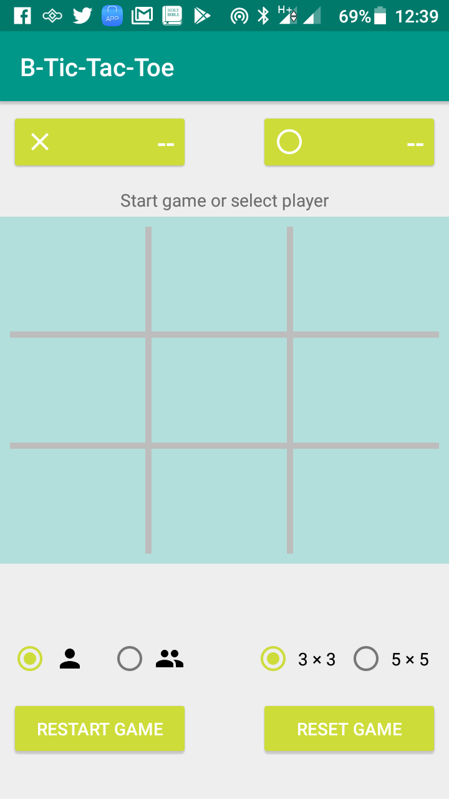
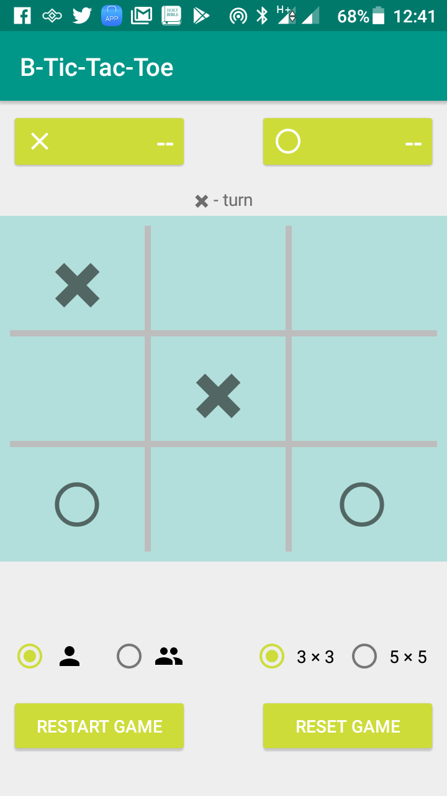
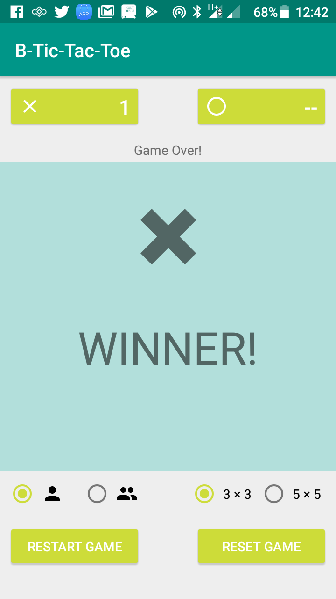
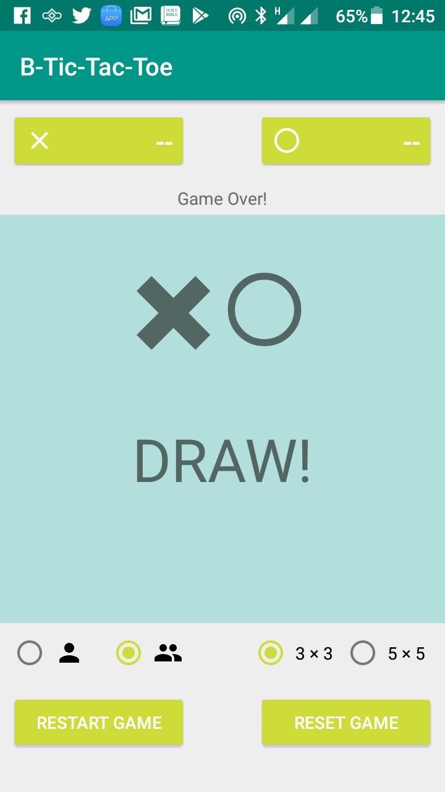
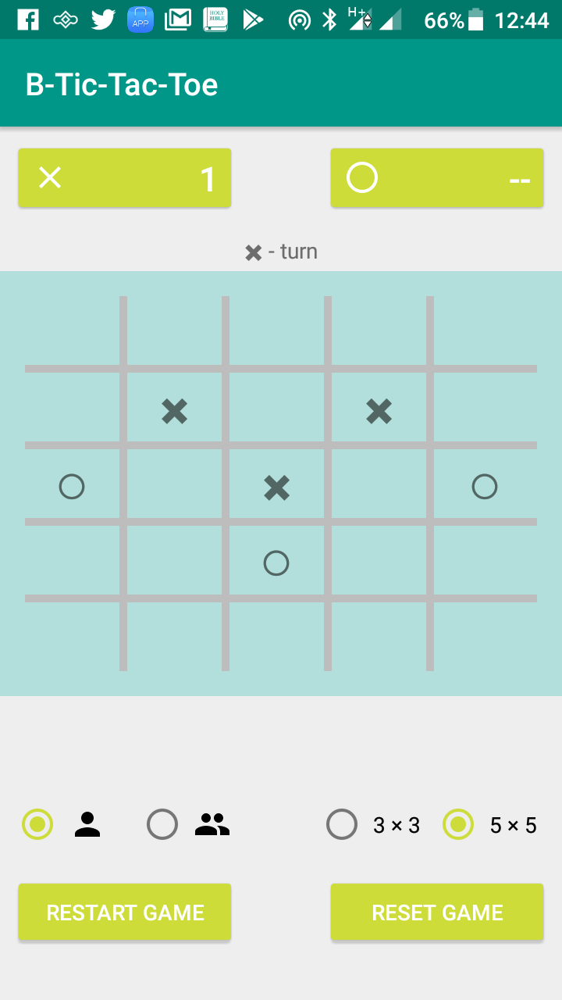
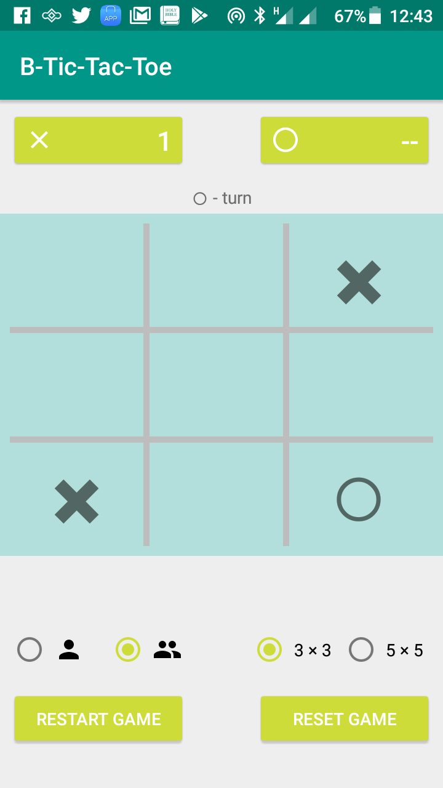

B Tic-Tac-Toe - a simple android game
---------------------------

A final project of the Andela ALC 2.0 Android Beginner track.
Demonstrates basic use of Android layouts and views. And use of java programming flow controls

Built in Android studio 3. You can clone it from within Android studio or import manually. 
Have fun!

PS: checkout the release apk

##Screenhots
Single Player (playing with machine)

<a href="" target="_blank">Five Square</a>

<a href="" target="_blank">Play with a friend mode</a>

Udacity</a>